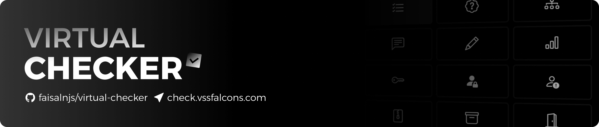

# Virtual Checker

Simplify homework distribution and grading with the next generation cloud hosted AI-powered homework checker, streamlining the educational experience for both students and educators with instant response matching and feedback.

- Courses, Periods, Segments, Questions, Responses
- Text, Choice, Math, Set, Matrix Response Modes
- Mastery, Correct, In Progress, Pending Statuses
- Passwords & Multi-device Settings Syncing
- Syllabus, Roster, Attachment Uploads
- Detailed Downloadable CSV Reports
- Known Correct & Incorrect Answers
- Instant AI Response Matching
- Flag Responses for Review
- Teacher Assistant Users
- Backups & Archiving
- Much More

## Development

`npm install`
`npm run dev`

Vite will start a development server at `localhost:5173`

## Build

`npm run build`

Serve the files that are generated in `/dist`

## Beta

A beta version of this project is hosted on [Dango Web Solutions](https://dangoweb.com/?from=virtual-checker) cloud hosting. The beta version is updated with the latest changes from the [`beta`](https://github.com/faisalnjs/Virtual-Checker/tree/beta) branch, and is used for testing new features and bug fixes before they are deployed to production. The beta version is not guaranteed to be stable and may contain bugs or unfinished features.

Files are transferred to the host using the GitHub Action automation workflow at [.github\workflows\deploy-beta.yml](https://github.com/faisalnjs/Virtual-Checker/tree/main/.github/workflows/deploy-beta.yml).

[&color=mediumseagreen)](https://github.com/faisalnjs/Virtual-Checker/actions/workflows/deploy-beta.yml)

## Production

This project is hosted on [Dango Web Solutions](https://dangoweb.com/?from=virtual-checker) cloud hosting - free web hosting for Education.

Files are transferred to the host using the GitHub Action automation workflow at [.github\workflows\deploy.yml](https://github.com/faisalnjs/Virtual-Checker/tree/main/.github/workflows/deploy.yml).

## API

API is hosted on [Dango Web Solutions](https://dangoweb.com/?from=virtual-checker) cloud hosting - free web hosting for Education.

The API is **required** to run this project, and must be hosted on the same server as where you are hosting this project. The private API repository can be found at [faisalnjs/homework-checker](https://github.com/faisalnjs/homework-checker).

### Credits

- [faisalnjs](https://github.com/faisalnjs) - Virtual Checker, Base Virtual Clicker
- [khui0](https://github.com/khui0) - Base Virtual Clicker
